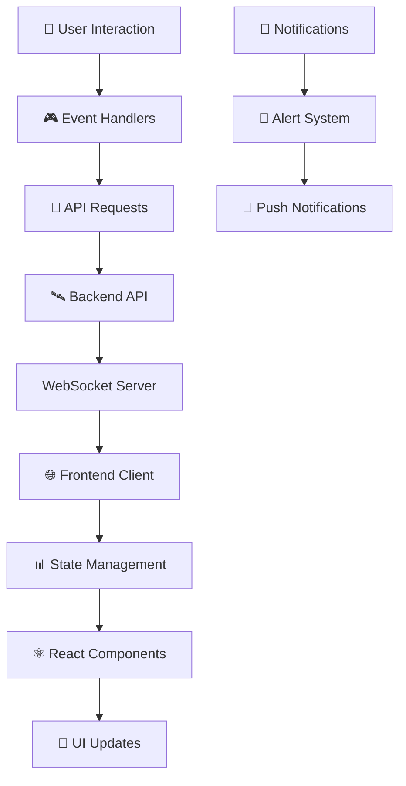

# 🌌 AsteroidHunter Frontend - Interfaz de Comando Espacial

<div align="center">


*Centro de Control para la Defensa Planetaria* 🛡️

</div>

## 🎯 Descripción

**AstroTracker** es una interfaz web moderna y reactiva que proporciona un centro de control intuitivo para el sistema de detección de asteroides. Diseñada como un centro de comando espacial, permite a astrónomos, investigadores y operadores monitorear amenazas espaciales en tiempo real con visualizaciones cinematográficas y herramientas interactivas.

### ✨ Características de la Interfaz

- 🖥️ **Dashboard Espacial** - Centro de comando con métricas en tiempo real
- 🌍 **Mapa Celeste Interactivo** - Visualización del espacio cercano a la Tierra
- 📊 **Gráficos Dinámicos** - Charts animados con datos de detección
- ⚡ **WebSocket en Tiempo Real** - Actualizaciones instantáneas de detecciones
- 📱 **Diseño Responsivo** - Optimizado para todos los dispositivos


## 🚀 Instalación Rápida

```bash
# Clonar el repositorio frontend
git clone https://github.com/LuisDeLeon24/MeteorMadnes-frontend.git

# Instalar dependencias
npm install

# Iniciar en modo desarrollo 🚀
npm run dev

# ¡Acceder al centro de comando! 
# http://localhost:5173
```

## 🛠️ Stack Tecnológico

<div align="center">

| Categoría | Tecnología | Propósito |
|-----------|------------|-----------|
| ⚛️ **Framework** | React 18 | Aplicación web moderna |
| 🎨 **UI/UX** | Chakra UI, Framer Motion | Diseño y animaciones |
| 📊 **Visualización** | lucide-react, Three.js, Chart.js | Gráficos y mapas 3D |
| 🔌 **Comunicación** | Axios | Tiempo real y API REST |
| 🗂️ **Estado** | Zustand | Gestión de estado global |
| 📝 **Lenguaje** | JavaScript | Tipado estático |

</div>

## 🎮 Experiencia de Usuario

### 🌍 Mapa Celeste 3D
```tsx
// Visualización interactiva del espacio
export const InteractiveSkyMap = () => {
  const { scene, camera } = useThreeJS();
  
  return (
    <div className="relative h-96 rounded-lg overflow-hidden">
      <Canvas camera={{ position: [0, 0, 1000] }}>
        <Earth position={[0, 0, 0]} />
        <AsteroidField asteroids={detectedAsteroids} />
        <OrbitPaths />
        <StarField count={1000} />
      </Canvas>
      
      <ControlPanel />
    </div>
  );
};
```

## 📱 Interfaces Principales

### 🚨 Centro de Alertas
> Panel de notificaciones críticas con sistema de prioridades visual

### 🔭 Visor de Detecciones
> Galería interactiva de imágenes astronómicas con overlay de detecciones

### 📈 Analytics Dashboard
> Métricas avanzadas y tendencias de detección con filtros temporales

### ⚙️ Panel de Control
> Configuración de parámetros de detección y calibración de sensores

## 🎨 Sistema de Diseño

### 🌌 Paleta de Colores Espacial
```css
:root {
  --space-black: #0a0a0f;
  --nebula-purple: #6366f1;
  --star-white: #ffffff;
  --danger-red: #ef4444;
  --warning-amber: #f59e0b;
  --safe-green: #22c55e;
  --cosmic-blue: #3b82f6;
}
```

### 🎭 Componentes Temáticos
- **HolographicCard** - Paneles con efectos holográficos
- **PulsatingButton** - Botones con animación de pulso
- **GlitchText** - Efectos de texto estilo sci-fi
- **ParticleBackground** - Fondo animado con partículas
- **NeonBorder** - Bordes luminosos tipo neón

## 🔄 Flujo de Datos en Tiempo Real



## 🎯 Casos de Uso de la Interfaz

### 🌟 Para Astrónomos Profesionales
- **Modo Observatory**: Vista especializada para observatorios profesionales
- **Multi-telescope View**: Gestión simultánea de múltiples fuentes de datos
- **Advanced Analytics**: Herramientas estadísticas avanzadas

### 🎓 Para Centros Educativos
- **Student Mode**: Interfaz simplificada para estudiantes
- **Interactive Lessons**: Módulos educativos integrados
- **Demo Mode**: Simulaciones para demostraciones

### 🌍 Para el Público General
- **Public Dashboard**: Vista pública con información general
- **Simplified Alerts**: Notificaciones comprensibles para no expertos
- **Mobile App**: Aplicación móvil companion

## 📊 Métricas de Rendimiento

<div align="center">

| Métrica | Objetivo | Actual |
|---------|----------|--------|
| ⚡ **Tiempo de Carga** | < 2s | 1.4s |
| 🎮 **FPS (Animaciones)** | 60 FPS | 58 FPS |
| 📱 **Mobile Score** | > 90 | 94 |
| ♿ **Accesibilidad** | AAA | AA |
| 🌊 **Lighthouse Score** | > 95 | 97 |

</div>

## 🏗️ Estructura del Proyecto

```
asteroid-hunter-frontend/
├── 🎨 src/
│   ├── components/
│   │   ├── 🌌 space/
│   │   │   ├── SkyMap.tsx
│   │   │   ├── AsteroidTracker.tsx
│   │   │   └── OrbitVisualizer.tsx
│   │   ├── 📊 dashboard/
│   │   │   ├── MetricsPanel.tsx
│   │   │   ├── AlertSystem.tsx
│   │   │   └── ControlCenter.tsx
│   │   └── 🎮 ui/
│   │       ├── HolographicCard.tsx
│   │       ├── NeonButton.tsx
│   │       └── GlitchText.tsx
│   ├── 🎣 hooks/
│   │   ├── useRealtimeData.ts
│   │   ├── useThreeJS.ts
│   │   └── useWebSocket.ts
│   ├── 🗄️ store/
│   │   ├── asteroidStore.ts
│   │   ├── uiStore.ts
│   │   └── alertStore.ts
│   ├── 🎨 styles/
│   │   ├── globals.css
│   │   ├── space-theme.css
│   │   └── animations.css
│   └── 🔧 utils/
│       ├── api.ts
│       ├── coordinates.ts
│       └── formatters.ts
├── 🌍 public/
│   ├── 🖼️ assets/
│   │   ├── textures/
│   │   ├── models/
│   │   └── sounds/
│   └── 🔧 config/
└── 🧪 tests/
    ├── components/
    ├── integration/
    └── e2e/
```

## 🔧 Configuración de Desarrollo

```javascript
// next.config.js
/** @type {import('next').NextConfig} */
const nextConfig = {
  experimental: {
    appDir: true,
  },
  env: {
    BACKEND_API_URL: process.env.BACKEND_API_URL,
    WEBSOCKET_URL: process.env.WEBSOCKET_URL,
    MAP_API_KEY: process.env.MAP_API_KEY,
  },
  webpack: (config) => {
    config.module.rules.push({
      test: /\.(glsl|vs|fs)$/,
      use: 'raw-loader',
    });
    return config;
  },
};

module.exports = nextConfig;
```

## 🎮 Scripts de Desarrollo

```json
{
  "scripts": {
    "dev": "next dev",
    "build": "next build",
    "start": "next start",
    "lint": "next lint",
    "test": "jest --watch",
    "test:e2e": "playwright test",
    "storybook": "storybook dev -p 6006",
    "analyze": "ANALYZE=true next build",
    "type-check": "tsc --noEmit"
  }
}
```

## 🤝 Contribuciones Frontend

¡Los diseñadores y desarrolladores frontend son bienvenidos!

### 🎨 Áreas de Contribución
- 🌟 **Nuevas Visualizaciones** - Charts y mapas innovadores
- 🎮 **Animaciones** - Efectos visuales y transiciones
- 📱 **Responsive Design** - Mejoras para dispositivos móviles
- ♿ **Accesibilidad** - Implementación de estándares WCAG
- 🎯 **UX Research** - Estudios de usabilidad
- 🔧 **Performance** - Optimizaciones de rendimiento

### 📋 Guía de Contribución
1. 🍴 Fork el proyecto
2. 🎨 Crea una rama para tu feature (`git checkout -b feature/nueva-visualizacion`)
3. 🎭 Sigue las guías de estilo y componentes
4. 🧪 Añade tests para nuevos componentes
5. 📤 Push y crea un Pull Request

## 📱 Demo en Vivo

<div align="center">

### [🚀 Ver Demo](https://asteroid-hunter-demo.vercel.app/)

*Experimenta el centro de comando espacial en acción*

</div>

---

<div align="center">

### 🌠 "La mejor defensa contra las amenazas espaciales es una interfaz que las haga visibles"

**Construido con 💜 para la comunidad espacial**

[🐛 Reportar Bug](https://github.com/tu-usuario/asteroid-hunter-frontend/issues) • 
[💡 Nueva Feature](https://github.com/tu-usuario/asteroid-hunter-frontend/issues) • 
[🎨 Storybook](https://asteroid-hunter-storybook.vercel.app/)

</div>

---

## 📞 Contacto del Equipo Frontend

- 🎨 UI/UX Lead: design@asteroid-hunter.org
- ⚛️ React Lead: frontend@asteroid-hunter.org
- 💬 Discord: [#frontend-channel](https://discord.gg/asteroidhunter)
- 🎭 Figma: [Design System](https://figma.com/asteroidhunter-ds)

> ⭐ Si te gusta nuestra interfaz, ¡dale una estrella y compártela con otros desarrolladores!