# 🌌 AsteroidHunter Frontend - Interfaz de Comando Espacial

<div align="center">


*Centro de Control para la Defensa Planetaria* 🛡️

</div>

## 🎯 Descripción

**AstroTracker** es una interfaz web moderna y reactiva que proporciona un centro de control intuitivo para el sistema de detección de asteroides. Diseñada como un centro de comando espacial, permite a astrónomos, investigadores y operadores monitorear amenazas espaciales en tiempo real con visualizaciones cinematográficas y herramientas interactivas.

### ✨ Características de la Interfaz

- 🖥️ **Dashboard Espacial** - Centro de comando con métricas en tiempo real
- 🌍 **Mapa Celeste Interactivo** - Visualización del espacio cercano a la Tierra
- 📊 **Gráficos Dinámicos** - Charts animados con datos de detección
- ⚡ **WebSocket en Tiempo Real** - Actualizaciones instantáneas de detecciones
- 📱 **Diseño Responsivo** - Optimizado para todos los dispositivos


## 🚀 Instalación Rápida

```bash
# Clonar el repositorio frontend
git clone https://github.com/LuisDeLeon24/MeteorMadnes-frontend.git

# Instalar dependencias
npm install

# Iniciar en modo desarrollo 🚀
npm run dev

# ¡Acceder al centro de comando! 
# http://localhost:5173
```

## 🛠️ Stack Tecnológico

<div align="center">

| Categoría | Tecnología | Propósito |
|-----------|------------|-----------|
| ⚛️ **Framework** | React 18 | Aplicación web moderna |
| 🎨 **UI/UX** | Chakra UI, Framer Motion | Diseño y animaciones |
| 📊 **Visualización** | lucide-react, Three.js, Chart.js | Gráficos y mapas 3D |
| 🔌 **Comunicación** | Axios | Tiempo real y API REST |
| 🗂️ **Estado** | Zustand | Gestión de estado global |
| 📝 **Lenguaje** | JavaScript | Tipado estático |

</div>

## 🎮 Experiencia de Usuario

## 📱 Interfaces Principales

### 🚨 Centro de Alertas
> Panel de notificaciones críticas con sistema de prioridades visual

### 🔭 Visor de Detecciones
> Galería interactiva de imágenes astronómicas con overlay de detecciones

### 📈 Analytics Dashboard
> Métricas avanzadas y tendencias de detección con filtros temporales

### ⚙️ Panel de Control
> Configuración de parámetros de detección y calibración de sensores

## 🎨 Sistema de Diseño

### 🌌 Paleta de Colores Espacial
```css
:root {
  --space-black: #0a0a0f;
  --nebula-purple: #6366f1;
  --star-white: #ffffff;
  --danger-red: #ef4444;
  --warning-amber: #f59e0b;
  --safe-green: #22c55e;
  --cosmic-blue: #3b82f6;
}
```

### 🎭 Componentes Temáticos
- **⌛ EN PROGRESO**

## 🔄 Flujo de Datos en Tiempo Real

```mermaid
graph TD
    A[🛰️ Backend API] --> B[WebSocket Server]
    B --> C[🌐 Frontend Client]
    C --> D[📊 State Management]
    D --> E[⚛️ React Components]
    E --> F[🎨 UI Updates]
    
    G[👤 User Interaction] --> H[🎮 Event Handlers]
    H --> I[📡 API Requests]
    I --> A
    
    J[🔔 Notifications] --> K[🚨 Alert System]
    K --> L[📱 Push Notifications]
```



## 📊 Métricas de Rendimiento - **EN PROGRESO ⌛**

<div align="center">

| Métrica | Objetivo | Actual |
|---------|----------|--------|
| ⚡ **Tiempo de Carga** | < 2s | 1.4s |
| 🎮 **FPS (Animaciones)** | 60 FPS | 58 FPS |
| 📱 **Mobile Score** | > 90 | 94 |
| ♿ **Accesibilidad** | AAA | AA |
| 🌊 **Lighthouse Score** | > 95 | 97 |

</div>

## 🏗️ Estructura del Proyecto **EN PROGRESO ⌛**

```
asteroid-hunter-frontend/
├── 🎨 src/
│   ├── components/
│   │   ├── 🌌 space/
│   │   │   ├── SkyMap.tsx
│   │   │   ├── AsteroidTracker.tsx
│   │   │   └── OrbitVisualizer.tsx
│   │   ├── 📊 dashboard/
│   │   │   ├── MetricsPanel.tsx
│   │   │   ├── AlertSystem.tsx
│   │   │   └── ControlCenter.tsx
│   │   └── 🎮 ui/
│   │       ├── HolographicCard.tsx
│   │       ├── NeonButton.tsx
│   │       └── GlitchText.tsx
│   ├── 🎣 hooks/
│   │   ├── useRealtimeData.ts
│   │   ├── useThreeJS.ts
│   │   └── useWebSocket.ts
│   ├── 🗄️ store/
│   │   ├── asteroidStore.ts
│   │   ├── uiStore.ts
│   │   └── alertStore.ts
│   ├── 🎨 styles/
│   │   ├── globals.css
│   │   ├── space-theme.css
│   │   └── animations.css
│   └── 🔧 utils/
│       ├── api.ts
│       ├── coordinates.ts
│       └── formatters.ts
├── 🌍 public/
│   ├── 🖼️ assets/
│   │   ├── textures/
│   │   ├── models/
│   │   └── sounds/
│   └── 🔧 config/
└── 🧪 tests/
    ├── components/
    ├── integration/
    └── e2e/
```

## 🤝 Contribuciones Frontend

¡Los diseñadores y desarrolladores frontend son bienvenidos!

### 🎨 Áreas de Contribución
- 🌟 **Nuevas Visualizaciones** - Charts y mapas innovadores
- 🎮 **Animaciones** - Efectos visuales y transiciones
- 📱 **Responsive Design** - Mejoras para dispositivos móviles
- ♿ **Accesibilidad** - Implementación de estándares WCAG
- 🎯 **UX Research** - Estudios de usabilidad
- 🔧 **Performance** - Optimizaciones de rendimiento

### 📋 Guía de Contribución
1. 🍴 Fork el proyecto
2. 🎨 Crea una rama para tu feature (`git checkout -b feature/nueva-visualizacion`)
3. 🎭 Sigue las guías de estilo y componentes
4. 🧪 Añade tests para nuevos componentes
5. 📤 Push y crea un Pull Request

## 📱 Demo en Vivo **EN PROGRESO ⌛**

<div align="center">

### [🚀 Ver Demo](https://asteroid-hunter-demo.vercel.app/)

*Experimenta el centro de comando espacial en acción*

</div>

---

<div align="center">

### 🌠 "La mejor defensa contra las amenazas espaciales es una interfaz que las haga visibles"

**Construido con 💜 para la comunidad Kinal**

[🐛 Reportar Bug](https://github.com/tu-usuario/asteroid-hunter-frontend/issues) • 
[💡 Nueva Feature](https://github.com/tu-usuario/asteroid-hunter-frontend/issues) • 
[🎨 Storybook](https://asteroid-hunter-storybook.vercel.app/)

</div>

---

> ⭐ Si te gusta nuestra interfaz, ¡dale una estrella y compártela con otros desarrolladores!